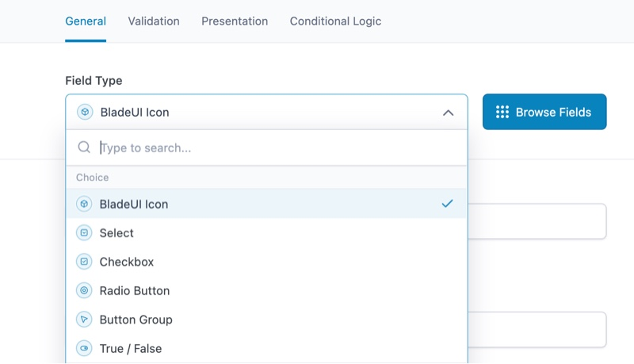
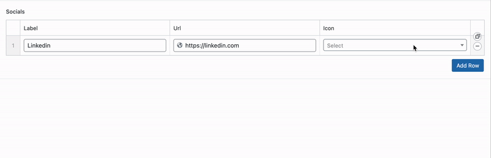

# ACF BladeUI Icons

This package introduces a new field to ACF that automatically populates with installed BladeUI Icons packages, providing access to over 126,000 icons!
The ACF BladeUI field also supports Select2, making it even easier to find the perfect icon.




## Requirements

- Acorn
- ACF Pro

## Installation

Follow these steps to install, set up, and use the package:

### Step 1. Install the Package

Use Composer to install the package:

```bash
composer require pkosciak/acf-bladeui-icons
```

### Step 2. Discover the package

Discover the package using Acorn:

```bash
wp acorn package:discover
```

### Step 3. Install an icon package

No icon sets are installed by default, so you will need to require them via Composer.

For a list of available icon packages, visit:
[Blade Icon Packages](https://github.com/blade-ui-kit/blade-icons?tab=readme-ov-file#icon-packages)

For example, to install Blade Heroicons, use the following command:

```bash
composer require blade-ui-kit/blade-heroicons
````

### Step 4. Discover the icon package

```bash
wp acorn package:discover
```

### Step 5. Create an icon field

Add a "BladeUI Icons" field to your ACF field group.
